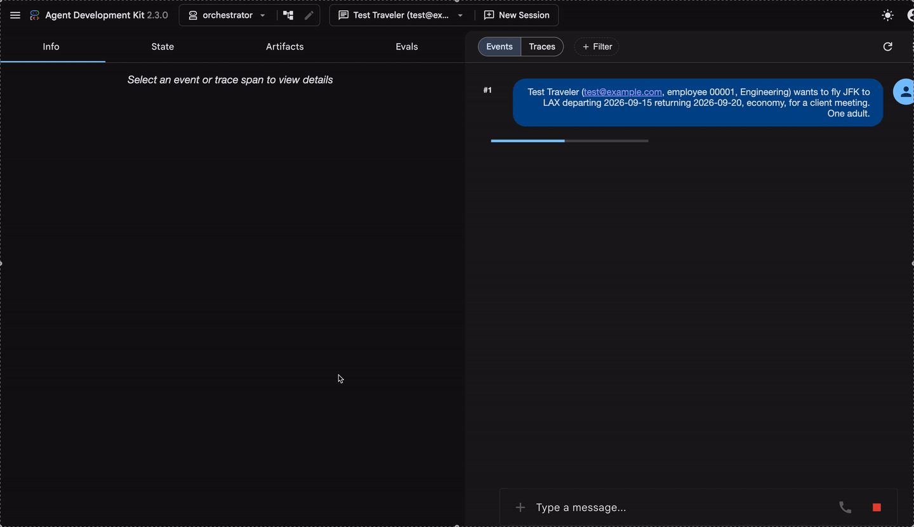

# Travel Pre-Trip Approval Multi-Agent Orchestrator

The **orchestrator** half of a two-service corporate travel pre-trip approval (trip authorization) system.
It collects trip and traveler information, translates it into the pricing engine's contract, applies corporate policy against the real fare quote, and assembles a final structured authorization decision.
The pricing half - a standalone Go A2A microservice - is in the [travel-fare-engine](https://github.com/yakyetilabs/travel-fare-engine) repository and is called over A2A as a remote Cloud Run service.

> **📦 Two-repo system — clone both:**
>
> - 🧭 **This repo (start here):** [travel-agent](https://github.com/yakyetilabs/travel-agent)
> - ⚙️ **Pricing engine:** [travel-fare-engine](https://github.com/yakyetilabs/travel-fare-engine)

## Demo

A natural-language trip request runs through five specialist agents - intake, fare_prep, the remote fare engine, policy, and the finalizer - and comes out as a structured, policy-checked authorization built on the real fare quote. The final record is assembled in code, not transcribed by an LLM.



Under the hood, the execution trace. The remote fare engine is the dominant span, while policy's deterministic checks (`check_budget`, `check_advance_purchase`, and the rest) resolve in microseconds - the "deterministic core, LLM shell" design, visible in the timings.


## Architecture

```
orchestrator (SequentialAgent)
  ├─ intake      LlmAgent — conversational trip collection [output_schema]
  ├─ fare_prep   LlmAgent — deterministic translation to engine [deterministic tool]
  ├─ fare_engine RemoteA2aAgent — remote Go service; computes the fare and returns FareQuote
  ├─ policy      LlmAgent — corporate policy checks [tools]
  └─ finalizer   SequentialAgent - prose by LLM, structure by code
       ├─ summary_writer       LlmAgent - writes the human summary [output_key]
       └─ finalizer_assembler  custom BaseAgent, no LLM - assembles PreTripApprovalOutput in pure Python
```

- **intake** talks to the user and gathers all required traveler + trip fields, including the trip type (one-way or round trip).
  When fields are missing it lists them in `missing_fields` and gates the result with `ready_for_policy=false`; downstream stages then degrade explicitly (fare_prep reports the gap, policy returns needs_review, the finalizer marks the outcome `incomplete`) until the traveler supplies the rest.
  Passenger rules mirror the engine's booking constraints - at most 9 seated passengers (adults + children) and one lap infant per adult - enforced in the intake schema and again by the translator and the engine.
- **fare_prep** deterministically transforms the human‑shaped trip (airport codes, trip type, dates, cabin class) into the engine's exact `FareQuoteRequest`: a journey of directional **fare components**, one per leg.
  Each component carries its own distance, advance‑purchase days, season code, and booking class derived from that leg's travel date — a December outbound and a January return genuinely price in different seasons and discount tiers.
  The LLM only calls the tool; the tool does all the derivation.
- **fare_engine** is a remote A2A service written in Go. It prices each fare component independently and sums base fares and taxes deterministically into a journey‑level `FareQuote`. The engine contains its own LLM guard that refuses to price incomplete requests, but under normal operation that path is never triggered because fare_prep guarantees completeness.
- **policy** evaluates the real `FareQuote` against budget, travel class, advance purchase, and trip-duration rules.
  Every check is a deterministic tool returning a three-way verdict: `pass`, `needs_approval` (a business cabin escalates to a manager), or `fail` (a first cabin, or any hard rule breach, denies the trip).
  The $2000 budget cap is a trip budget cap: it applies to the quoted journey total - both legs of a round trip, all passengers on the booking, guest travelers included.
  The duration check applies only to round trips (one-way trips skip it), and a same-day round trip is a legitimate day trip.
  If the engine returns no quote (outage, timeout, or refusal to price), `check_budget` runs without a fare and returns `needs_approval`, so the trip escalates to a manager instead of being approved with its budget unverified.
  All thresholds are module constants in [tools/policy.py](tools/policy.py); the LLM neither applies policy itself nor passes thresholds to the tools.
- **finalizer** is two agents in sequence: `summary_writer` (LLM) writes the 1-3 sentence human summary - the only generative field in the output - and `finalizer_assembler` (a model-free custom agent) assembles `PreTripApprovalOutput` in pure Python from intake, policy, and fare results.
  The fare quote is copied verbatim from the current invocation's engine response, never retyped by a model, mirroring the engine's own deterministic quote passthrough.

## What this project demonstrates

The travel domain is the vehicle, not the point.
This system exists to demonstrate six transferable principles for building trustworthy, enterprise-grade agentic systems.
Swap travel for mortgages or insurance and every one of them still applies.

1. **Deterministic core, LLM shell.**
   LLMs never compute a number or make a policy decision.
   They translate human input into structured requests, decide when to call tools, and explain results.
   Every dollar figure and every approve/deny verdict comes from a pure, unit-tested function ([tools/fare_request.py](tools/fare_request.py), [tools/policy.py](tools/policy.py), and the engine's `Calculate`).
   The final approval record is likewise assembled in code ([agents/finalizer/assembler.py](agents/finalizer/assembler.py)); the only LLM-authored field in the output is the prose summary.
   This is the trust argument for using LLMs anywhere near money or compliance.

2. **Hard contracts between independently deployable agent services.**
   Two repos, two languages, no shared library - on purpose.
   The boundary is a published, discoverable contract (the A2A agent card); the enum vocabularies are duplicated intentionally, and drift is caught mechanically by tripwire tests on both sides ([tests/test_contract.py](tests/test_contract.py) here, `TestTripwire_*` in the engine).
   This answers the question: how do two teams evolve AI services independently without the integration rotting?

3. **Privacy by construction, not by policy.**
   The pricing service cannot leak PII because it never receives any - no names, no employee IDs, not even airport codes; only derived numerics such as distance and advance-purchase days.
   Data minimisation is enforced by the shape of the contract itself, which is what makes the engine's logs safe to retain and audit.

4. **Sequence decisions after facts exist.**
   The pipeline order is itself a correctness device: policy runs after pricing, so the budget decision consumes the real quoted journey total, never an estimate.
   Generalised: arrange the workflow so every decision-maker acts on ground truth that already exists.

5. **Typed state as the inter-agent interface.**
   Agents hand each other validated Pydantic/JSON structures through session state, not free-form prose.
   The repo also documents the ADK-specific craft this requires: the output_schema-vs-tools trade-off, `output_key` templating, and the deterministic finalizer pattern (the decisions are in [docs/DECISIONS.md](docs/DECISIONS.md); the gotchas behind them in [docs/LESSONS.md](docs/LESSONS.md)).

6. **Engineering rigor applied to agents.**
   Eval sets pin tool trajectories with a baseline-before-change discipline; contract tripwires run in CI; and unit tests prove the translator can never emit a request the engine would reject, across every advance-purchase day of the year ([tests/test_fare_request.py](tests/test_fare_request.py)).
   That is "make invalid states unrepresentable" applied across a service boundary - alongside keyless CI via Workload Identity Federation and IAM-gated services.

## The two‑service boundary

The orchestrator and the fare engine communicate **only** through the A2A protocol. The contract is:

- **Input:** `FareQuoteRequest` — validated, derived values only (no PII, no raw airport codes). A journey of one (one‑way) or two (round‑trip) directional fare components.
- **Output:** `FareQuote` — a structured JSON object with journey totals (base fare, taxes, total), per‑component fare basis codes and fare rules, and a quote ID.
- **Discovery:** The engine publishes its capabilities via an agent card at `/.well-known/agent-card.json`. The orchestrator reads this card to create the remote agent — no hard‑coded schemas.

All enumerations (cabin class, booking class, route type, season, passenger type, journey type, direction) are **duplicated intentionally** between the two repositories. A CI tripwire test (`tests/test_contract.py`) fails the build if the orchestrator’s local enum lists ever drift from the engine’s published card. This duplication is the price of independent deployability: each service can evolve on its own cadence as long as the A2A contract holds.

**Privacy by construction:** The fare engine never receives names, email addresses, employee IDs, department information, or even airport codes. It operates solely on derived numeric fields (distance in miles, passenger counts, advance‑purchase days). This boundary enforces data minimisation and makes the engine’s logs safe to retain and audit.

## Deterministic core

The critical business logic that converts a trip into a fare engine request lives in [`tools/fare_request.py`](tools/fare_request.py). It is pure Python, fully testable, and contains no LLM calls. The same applies to the policy checks and the engine’s own `compute_fare` tool. The LLM agents serve as **structured translation layers**: they decide _when_ to call their tools, but never perform the calculations themselves.

## Security posture

- **Cloud Run** with `--no-allow-unauthenticated` on both services.
- **Dedicated service accounts** with minimal IAM (`roles/aiplatform.user` for Vertex AI, `roles/run.invoker` for cross‑service calls).
- **Workload Identity Federation** for CI/CD — no service‑account keys stored or generated.
- The orchestrator authenticates to the engine with a short‑lived Google identity token (`_GCPIdTokenAuth`). When running locally against a local engine, authentication is skipped automatically.

## Setup

```bash
uv sync
cp .env.example .env        # then fill in GEMINI_API_KEY and FARE_ENGINE_URL
```

Key env vars (see [`.env.example`](.env.example)):

- `FARE_ENGINE_URL` — the fare engine's base URL (`http://localhost:8081` locally).
- `GEMINI_API_KEY` — for local dev (or set `GOOGLE_GENAI_USE_VERTEXAI=TRUE` + project/location).
- `GOOGLE_APPLICATION_CREDENTIALS` — only for local dev against a deployed,
  authenticated engine (mints the ID token). Unset in Cloud Run; the metadata
  server is used automatically.

## Run locally

```bash
# Terminal 1 — start the Go fare engine on :8081 (see its repo)
# Terminal 2 — the orchestrator dev UI
adk web        # then open http://localhost:8000 and pick "orchestrator"
```

## Test and evaluation

```bash
pytest                                      # unit tests + contract tripwire
adk eval agents/intake   eval/intake.evalset.json    --config_file_path eval/test_config.json
adk eval agents/fare_prep eval/fare_prep.evalset.json --config_file_path eval/test_config.json
```

- **Contract tripwire:** tests/test_contract.py reads the engine’s agent card and asserts the orchestrator’s expected enums match. Any drift breaks the build immediately.

- **Evals:** Structured eval sets for intake and fare_prep verify that given a known conversation or session state, the agents call the right tools with the right arguments and produce the expected output. Baseline evals must pass before merging changes to agent prompts or tools.

## Deploy

```bash
gcloud run deploy travel-prequal --source .
```

The orchestrator’s runtime service account must hold `roles/run.invoker` on the fare engine’s Cloud Run service. See `CLOUDBUILD.md` and the engine’s documentation for the full IAM setup.

## What’s in place

- **Stateless orchestrator** — no session affinity, scales horizontally.
- **Pinned contract** — enum vocabularies duplicated and tripwire‑tested.
- **Deterministic translation** — build_fare_request derives the journey's fare components (distance, advance days, booking class, season, per leg) without an LLM.
- **A2A discovery** — the remote engine is configured via its agent card, not hard‑coded.
- **Eval harness** — intake and fare_prep evals with expected tool trajectories.
- **CI/CD** — PR checks run unit tests, the contract tripwire, and the ADK evals (model‑in‑the‑loop on Vertex AI, keyless WIF auth); merge to main deploys to Cloud Run (the source build runs in Cloud Build) with deploy gated on tests **and** evals.

## Known gaps

- **No persistence.** Quotes and decisions are returned to the caller but not stored. A production system would persist the full decision in a database for compliance and auditing.
- **No audit log.** Every authorization decision should be recorded with inputs, outputs, and decision timestamps in tamper‑evident storage.
- **Simplified fare engine.** The pricing engine uses a small set of hard‑coded tables. A real deployment would integrate with live ATPCO fares, corporate negotiated rates, or a GDS.
- **Intake readiness is reported, not enforced.** The intake agent emits a `ready_for_policy` flag and a `missing_fields` list when a request is incomplete, but the `SequentialAgent` orchestrator does not gate on it, so a partial request still flows downstream. The natural extension is to wrap intake in a clarification `LoopAgent` that repeats until `ready_for_policy=True` before pricing runs.
- **No automated rollback.** Cloud Run’s revision model keeps the previous version serving on failure, but the pipeline does not automatically revert or alert on smoke‑test failure.
- **No backoff for model rate limits (429 / dynamic shared quota).** Gemini 2.5 Flash runs under Vertex AI's dynamic shared quota, so under regional contention a call is throttled (slow) or rejected with `429 RESOURCE_EXHAUSTED`; the SDK retries briefly and then the whole invocation fails with a stack trace. A user‑facing deployment needs longer exponential backoff with jitter and a graceful degrade ("model busy, try again") instead of a hard failure, applied both in the orchestrator agents and in the engine's inbound LLM. Provisioned Throughput would remove the contention entirely but at a fixed monthly cost.
- **Fare hold not honored.** Quote IDs are returned with an expiration (the engine's fixed fare-hold window), but there is no mechanism to guarantee the same fare if the user returns within the window.
- **Ingress for CI.** Cloud Run ingress is set to all (but still requires authentication) to allow GitHub‑hosted runners to reach the deployed service. A stricter posture would move smoke tests inside the project.

  **New here?**

> Read [docs/ARCHITECTURE.md](docs/ARCHITECTURE.md) for how the two fit together,
> [docs/DECISIONS.md](docs/DECISIONS.md) for the design decisions and the alternatives we rejected,
> [DEPLOY.md](docs/DEPLOY.md) to stand up your own, and [LESSONS.md](docs/LESSONS.md) for the gotchas (and the concepts behind them).
