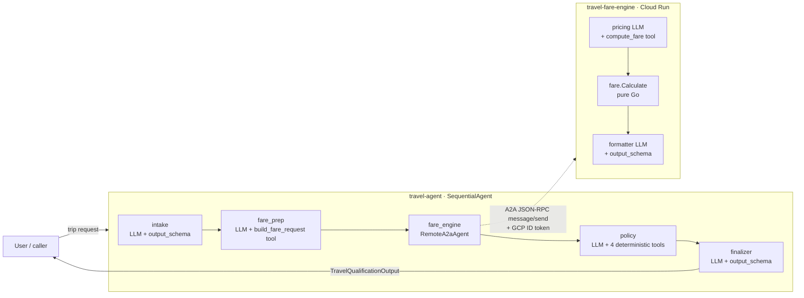

# System Architecture — Travel Pre-Qualification

How the two repositories work together **as currently implemented**. This is the
end-to-end view; each repo's own `README.md` covers its internals.

- **`travel-agent`** (this repo) — Python / ADK 2.0 orchestrator. The brain:
  collects the trip, derives the pricing request, applies corporate policy,
  assembles the final decision.
- **`travel-fare-engine`** — Go A2A microservice. The calculator: deterministic
  fare math behind an LLM transport wrapper.

They are **separate deployables** that share no code — only a wire contract.

---

## 1. The big picture



The orchestrator is a single `SequentialAgent` (`agents/orchestrator/agent.py`)
whose five sub-agents run in order, passing data through **session state**. One of
those sub-agents, `fare_engine`, is not local — it's a `RemoteA2aAgent` that calls
the Go service over the network.

---

## 2. Why this exact order

```
intake → fare_prep → fare_engine → policy → finalizer
```

The two systems speak different languages on purpose:

| Concept        | Human / intake terms            | Engine / pricing terms                          |
| -------------- | ------------------------------- | ----------------------------------------------- |
| Where          | `origin`, `destination` (IATA)  | `base_distance_miles`, `route_type`             |
| When           | `departure_date`, `return_date` | `advance_purchase_days`, `season_code`          |
| What seat      | `travel_class` (cabin)          | `cabin_class` **+** `booking_class` (fare class) |

`fare_prep` is the **translation layer** between them. The engine's own design
deliberately refuses to know about airports or dates-as-dates ("the engine never
knows actual airports"), so the orchestrator must derive the pricing inputs. That
derivation is `tools/fare_request.py` — pure, deterministic Python.

`policy` runs **after** the engine so its budget rule can compare against the real
quoted `total_fare` instead of guessing before a price exists.

---

## 3. Request lifecycle (what each stage reads and writes)

Session state is the conveyor belt. `output_key` writes a value; `{key}` template
substitution reads it.

| Stage          | Reads                                  | Does                                                                                          | Writes (`output_key`) |
| -------------- | -------------------------------------- | -------------------------------------------------------------------------------------------- | --------------------- |
| **intake**     | user message                           | Parses free text → structured trip; lists `missing_fields`; sets `ready_for_policy`.          | `intake_output`       |
| **fare_prep**  | `{intake_output}`                      | Calls `build_fare_request(...)` → derives distance, route, season, advance days, booking class.| `fare_request`        |
| **fare_engine**| `fare_request` (in conversation)       | A2A call to the Go service; its `pricing`→`formatter` pipeline returns a `FareQuote`.          | — (reply in history)  |
| **policy**     | `{intake_output}` + FareQuote in history | Calls `check_budget` (uses `total_fare`), `check_travel_class`, `check_advance_purchase`, `check_max_trip_duration`. | `policy_decision`     |
| **finalizer**  | `{intake_output}`, `{policy_decision}`, FareQuote in history | Assembles `TravelQualificationOutput`; derives `final_decision`. No tools, no recompute.       | `orchestrator_output` |

### `final_decision` logic (in the finalizer prompt)

```
ready_for_policy == False        → "incomplete"
policy_decision.status == denied → "denied"
policy_decision.status == needs_review → "needs_review"
otherwise                        → "approved"
```

A `business`/`first` cabin additionally sets `requires_manager_approval=True` on
the policy decision (an approved trip can still need sign-off).

---

## 4. The A2A boundary (the actual network hop)

The only place the two repos touch:

1. **Discovery.** On startup the `RemoteA2aAgent` fetches the engine's
   `{FARE_ENGINE_URL}/.well-known/agent-card.json`. The card advertises the
   service's interface URL and the `compute_fare` skill's input schema. *(The
   engine rewrites that URL at startup from its `HOST_URL`, so a deployed engine
   must set `HOST_URL` or the card would advertise `localhost`.)*
2. **Invocation.** ADK sends an A2A **JSON-RPC 2.0 `message/send`** request. The
   user-role text carries the fare request; the engine's `pricing` LLM maps it to
   a `compute_fare` tool call.
3. **Auth.** Every call carries a **GCP ID token**. `agents/orchestrator/agent.py`
   implements `_GCPIdTokenAuth` (an `httpx.Auth`): it mints an ID token for the
   engine's URL as audience, caches it, and refreshes 60s before expiry. The
   engine runs `--no-allow-unauthenticated`, so unauthenticated calls are rejected
   at the platform edge before any code runs.
4. **Response.** The engine returns a schema-validated `FareQuote` (base fare,
   taxes, total, fare rules, breakdown, quote id, expiry). The finalizer copies it
   verbatim into the output.

### The shared contract (no shared code)

Five enum vocabularies — cabin, booking, route, season, passenger — are
**duplicated by design** in both repos so they stay independently deployable. A
tripwire test on each side fails the build if they drift:

- engine: `internal/domain/fare/schema_test.go` (card vs. exported slices)
- orchestrator: `tests/test_contract.py` (local Literals vs. the engine card)

---

## 5. Error & edge-case flow

The pipeline is linear (no conditional branching), so every stage runs; failures
degrade gracefully rather than throwing:

- **Intake incomplete** → `ready_for_policy=False`. Downstream stages still run but
  produce empty/error results; the finalizer short-circuits to `incomplete`.
- **Unpriceable trip** (unknown airport, past date, >9 passengers) → `fare_prep`'s
  tool returns `{"ok": false, "error": ...}`; no valid `FareQuote` appears; the
  finalizer sets `fare_quote = null`. `policy` skips the budget check and notes the
  fare was unavailable.
- **Engine rejects the request** → its `Calculate()` validation error surfaces as
  the A2A reply; same `null` fare path. *(By construction `build_fare_request` only
  emits engine-valid requests — distance clamped to 100–10000, booking class chosen
  to satisfy advance-purchase minimums — so this should be rare.)*

---

## 6. Configuration that ties them together

| Setting              | Where                         | Purpose                                                        |
| -------------------- | ----------------------------- | ------------------------------------------------------------- |
| `FARE_ENGINE_URL`    | orchestrator `.env`           | Base URL of the engine (card discovery + token audience).      |
| `HOST_URL`           | engine env                    | URL the engine advertises in its agent card.                   |
| `GEMINI_API_KEY`     | both (local dev)              | AI Studio key for model calls when not using Vertex.           |
| `GOOGLE_GENAI_USE_VERTEXAI` + `GOOGLE_CLOUD_PROJECT`/`LOCATION` | orchestrator | Route the orchestrator's Gemini calls through Vertex AI in prod. |
| `roles/run.invoker`  | IAM binding                   | Lets the orchestrator's service account call the engine.       |

---

## 7. Current status (what is real vs. designed)

- ✅ **Local end-to-end** logic is implemented and the deterministic seam is
  verified: `build_fare_request` output is accepted and priced by the engine.
- ✅ **Contract tripwires** on both sides, **eval scaffolding** on both sides.
- ⚠️ **Cloud deployment is designed but not provisioned** — no GCP project,
  services, IAM bindings, CI, or Secret Manager are stood up yet. See
  [`docs/CLOUD-READINESS.md`](CLOUD-READINESS.md) for the gap list. `adk eval` and
  a live A2A round-trip require model credentials not present in the dev sandbox.
