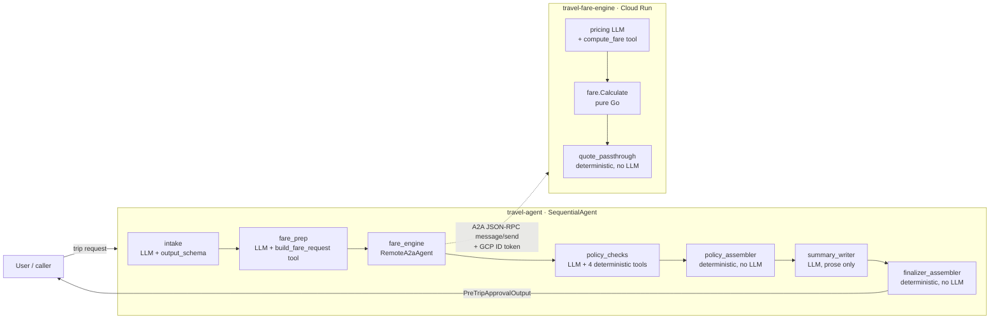

# System Architecture — Travel Pre-Trip Approval

How the two repositories work together **as currently implemented**. This is the
end-to-end view; each repo's own `README.md` covers its internals.

- **`travel-agent`** (this repo) — Python / ADK 2.0 orchestrator. The brain:
  collects the trip, derives the pricing request, applies corporate policy,
  assembles the final decision.
- **`travel-fare-engine`** — Go A2A microservice. The calculator: deterministic
  fare math behind an LLM transport wrapper.

They are **separate deployables** that share no code — only a wire contract.

---

## 1. The big picture



The orchestrator is a single `SequentialAgent` (`agents/orchestrator/agent.py`)
whose five sub-agents run in order, passing data through **session state**. One of
those sub-agents, `fare_engine`, is not local — it's a `RemoteA2aAgent` that calls
the Go service over the network.
The fifth, `finalizer`, is itself a two-step `SequentialAgent`: an LLM writes the prose summary, then a model-free assembler builds the structured output in code (§3).
The `policy` stage uses the same split: `policy_checks` (LLM) only calls the check tools, then `policy_assembler` (no model) applies the decision rule and writes the `PolicyDecision`.
Both repos end the same way on purpose: the last node before the caller (`quote_passthrough` there, `finalizer_assembler` here) is deterministic code, so no LLM sits between computed data and the consumer.

---

## 2. Why this exact order

```
intake → fare_prep → fare_engine → policy → finalizer
```

The two systems speak different languages on purpose:

| Concept        | Human / intake terms                  | Engine / pricing terms                          |
| -------------- | ------------------------------------- | ----------------------------------------------- |
| Journey shape  | `trip_type` (one-way / round trip)    | `journey_type` + one `fare_component` per leg   |
| Where          | `origin`, `destination` (IATA)        | `base_distance_miles`, `route_type`             |
| When           | `departure_date`, `return_date`       | per-leg `advance_purchase_days`, `season_code`  |
| What seat      | `travel_class` (cabin)                | `cabin_class` **+** per-leg `booking_class` (fare class) |

`fare_prep` is the **translation layer** between them. The engine's own design
deliberately refuses to know about airports or dates-as-dates ("the engine never
knows actual airports"), so the orchestrator must derive the pricing inputs. That
derivation is `tools/fare_request.py` — pure, deterministic Python. A round trip
becomes two directional fare components, each priced from its own travel date
(its own season, advance-purchase tier, and booking class); the engine sums the
components into the journey totals.

### Glossary (industry terms behind the field names)

- **travel_class vs cabin_class** - the same concept in two vocabularies.
  Intake speaks the traveler's language (`travel_class`); the pricing contract speaks the airline's (`cabin_class`).
  The split is intentional, not an oversight: the translator maps one to the other so neither side leaks its vocabulary into the other (see the `tools/fare_request.py` docstring).
- **booking_class** - the fare class within a cabin, industry name RBD (Reservation Booking Designator): `Y B M H Q G K`.
  One cabin sells under many booking classes at different prices and restrictions; this is why the contract needs both fields.
- **Passenger types** - `adult`, `child`, `infant` correspond to the industry PTC codes ADT/CHD/INF.
  An infant is a lap infant: no seat, priced at 10% of the adult base, at most one per adult.
- **Fare component / fare construction** - a directional priced unit of a journey; a round trip is the sum of an outbound and a return component.
- **Fare basis code** - the compact code (e.g. `MLXNN1N`) encoding a component's pricing conditions.
- **Fare hold** - the short window (`expires_at`) during which a quote is intended to be honored.

`policy` runs **after** the engine so its budget rule can compare against the real
quoted `total_fare` instead of guessing before a price exists.

---

## 3. Request lifecycle (what each stage reads and writes)

Session state is the conveyor belt. `output_key` writes a value; `{key}` template
substitution reads it.

| Stage          | Reads                                  | Does                                                                                          | Writes (`output_key`) |
| -------------- | -------------------------------------- | -------------------------------------------------------------------------------------------- | --------------------- |
| **intake**     | user message                           | Parses free text → structured trip; lists `missing_fields`; sets `ready_for_policy`.          | `intake_output`       |
| **fare_prep**  | `{intake_output}`                      | Calls `build_fare_request(...)` → derives the journey's fare components (distance, route, and per-leg season, advance days, booking class).| `fare_request`        |
| **fare_engine**| `fare_request` (in conversation)       | A2A call to the Go service; its `pricing`→`quote_passthrough` pipeline returns the `FareQuote` verbatim from the tool. | — (reply in history)  |
| **policy_checks** | `{intake_output}` + FareQuote in history | Calls `check_budget` (uses `total_fare`), `check_travel_class`, `check_advance_purchase`, `check_max_trip_duration`; each returns a `pass`/`needs_approval`/`fail` verdict. Makes no decision itself. | — (tool results as events) |
| **policy_assembler** | this invocation's tool-result events + `{intake_output}` | Pure Python (`agents/policy/assembler.py`): applies the decision rule (`rules.py`), compiles the verbatim tool reasons in call order, emits the `PolicyDecision` JSON. No LLM. | `policy_decision`     |
| **summary_writer** | `{intake_output}`, `{policy_decision}`, FareQuote in history | Writes the 1-3 sentence human summary - the output's only LLM-authored field. No tools, no schema. | `approval_summary`    |
| **finalizer_assembler** | session state + this invocation's `fare_engine` event | Pure Python (`agents/finalizer/assembler.py`): copies traveler/trip, parses the policy JSON, extracts the FareQuote verbatim, derives `final_decision`, attaches the summary. No LLM. | `orchestrator_output` |

### `final_decision` logic (in code: `agents/finalizer/assembler.py`)

```
ready_for_policy == False              → "incomplete"
policy JSON missing or unparseable     → "needs_review" (never approve on an unreadable decision)
policy_decision.status == denied       → "denied"
policy_decision.status == needs_review → "needs_review"
otherwise                              → "approved"
```

The FareQuote is extracted only from the **current invocation's** `fare_engine`
event, so a stale quote from an earlier run in the same session can never leak
into a later approval record.
Why the finalizer is split this way - an LLM for prose, code for structure - and
the alternatives we rejected are recorded in [DECISIONS.md](DECISIONS.md) §4.

Every policy tool returns a three-way verdict: `pass`, `needs_approval`, or `fail`
(`agents/policy/rules.py` is the decision rule `policy_assembler` executes at runtime).
Any `fail` denies the trip; otherwise any `needs_approval` yields `needs_review`
with `requires_manager_approval=True` - real pre-trip approval escalates
out-of-policy requests to a manager rather than flat-denying them.
A `business` cabin escalates; a `first` cabin is prohibited outright.
A missing fare quote is itself a `needs_approval` verdict from `check_budget`
(the budget cannot be verified), so an engine failure escalates the trip and can
never produce an unverified approval.
The thresholds (the $2000 trip budget cap, allowed cabins, 7-day advance-purchase
minimum, 14-day duration limit) are module constants in `tools/policy.py`; the
tools take only trip and fare data, so the LLM cannot pass - or weaken - a
threshold. The budget cap applies to the quoted journey total: all legs, all
passengers on the booking, guest travelers included.

---

## 4. The A2A boundary (the actual network hop)

The only place the two repos touch:

1. **Discovery.** On startup the `RemoteA2aAgent` fetches the engine's
   `{FARE_ENGINE_URL}/.well-known/agent-card.json`. The card advertises the
   service's interface URL and the `compute_fare` skill's input schema. *(The
   engine rewrites that URL at startup from its `HOST_URL`, so a deployed engine
   must set `HOST_URL` or the card would advertise `localhost`.)*
2. **Invocation.** ADK sends an A2A **JSON-RPC 2.0 `message/send`** request. The
   user-role text carries the fare request; the engine's `pricing` LLM maps it to
   a `compute_fare` tool call.
3. **Auth.** Every call carries a **GCP ID token**. `agents/orchestrator/agent.py`
   implements `_GCPIdTokenAuth` (an `httpx.Auth`): it mints an ID token for the
   engine's URL as audience, caches it, and refreshes 60s before expiry. The
   engine runs `--no-allow-unauthenticated`, so unauthenticated calls are rejected
   at the platform edge before any code runs.
4. **Response.** The engine returns a schema-validated `FareQuote` (base fare,
   taxes, total, fare rules, breakdown, quote id, expiry). The `finalizer_assembler`
   copies it verbatim into the output - in code, never through a model.

### The shared contract (no shared code)

Five enum vocabularies — cabin, booking, route, season, passenger — are
**duplicated by design** in both repos so they stay independently deployable. A
tripwire test on each side fails the build if they drift:

- engine: `internal/domain/fare/schema_test.go` (card vs. exported slices)
- orchestrator: `tests/test_contract.py` (local Literals vs. the engine card)

---

## 5. Error & edge-case flow

The pipeline is linear (no conditional branching), so every stage runs; failures
degrade gracefully rather than throwing:

- **Intake incomplete** → `ready_for_policy=False`. Downstream stages still run but
  produce empty/error results; the assembler short-circuits to `incomplete`.
- **Unpriceable trip** (unknown airport, past date, >9 seated passengers, more
  lap infants than adults) → `fare_prep`'s
  tool returns `{"ok": false, "error": ...}`; no valid `FareQuote` appears; the
  assembler sets `fare_quote = null`.
- **Policy output unreadable** (missing, or invalid JSON, while the trip was ready
  for policy) → the assembler records a synthesized `needs_review` decision with
  `requires_manager_approval=true`.
  Garbage can degrade an approval, never create one - the same stance as the
  malformed-counts-as-fail rule in `agents/policy/rules.py`.
- **Engine rejects the request** → its `Calculate()` validation error surfaces as
  the A2A reply; same `null` fare path. *(By construction `build_fare_request` only
  emits engine-valid requests — distance clamped to 100–10000, booking class chosen
  to satisfy advance-purchase minimums — so this should be rare.)*
- **Engine unreachable or times out** → the A2A call yields an error event and no
  `FareQuote`; same `null` fare path.
- **Whenever no `FareQuote` exists**, `check_budget` runs with no fare and returns
  a `needs_approval` verdict ("budget cannot be verified"), so the trip escalates
  to `needs_review` with `requires_manager_approval=true`.
  A missing mandatory check can never count as a pass: an engine outage escalates
  to a human, it does not auto-approve.

---

## 6. Configuration that ties them together

| Setting              | Where                         | Purpose                                                        |
| -------------------- | ----------------------------- | ------------------------------------------------------------- |
| `FARE_ENGINE_URL`    | orchestrator `.env`           | Base URL of the engine (card discovery + token audience).      |
| `HOST_URL`           | engine env                    | URL the engine advertises in its agent card.                   |
| `GEMINI_API_KEY`     | both (local dev)              | AI Studio key for model calls when not using Vertex.           |
| `GOOGLE_GENAI_USE_VERTEXAI` + `GOOGLE_CLOUD_PROJECT`/`LOCATION` | orchestrator | Route the orchestrator's Gemini calls through Vertex AI in prod. |
| `roles/run.invoker`  | IAM binding                   | Lets the orchestrator's service account call the engine.       |

---

## 7. Current status (what is real vs. designed)

- ✅ **Local end-to-end** logic is implemented and the deterministic seam is
  verified: `build_fare_request` output is accepted and priced by the engine.
- ✅ **Contract tripwires** on both sides, **eval scaffolding** on both sides.
- ⚠️ **Cloud deployment is designed but not provisioned** — no GCP project,
  services, IAM bindings, CI, or Secret Manager are stood up yet. See
  [`docs/CLOUD-READINESS.md`](CLOUD-READINESS.md) for the gap list. `adk eval` and
  a live A2A round-trip require model credentials not present in the dev sandbox.
